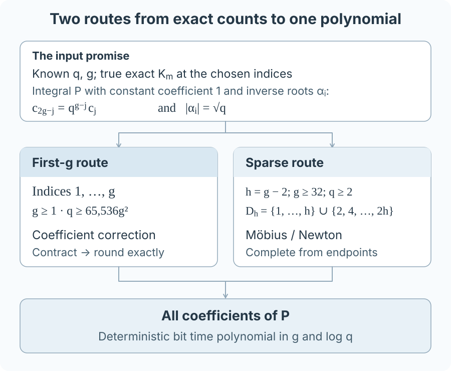

# Sparse Weil Reconstruction

### Exact reconstruction from selected extension-field counts

An abelian variety's Frobenius polynomial determines its cardinalities over
every finite extension. This project studies the reverse direction:
**recovering that polynomial from a small set of exact cardinalities**.

There are two reconstruction regimes. The first uses exactly the first $`g`$
counts under a quadratic sufficient field-size bound. The second uses a sparse
selection of additional counts and covers every field when $`g\ge32`$.
Both algorithms have deterministic polynomial bit complexity.

<p align="center">
  
</p>

## Read the repository in three passes

| Time | Route | Purpose |
|---|---|---|
| 5 minutes | This page | Problem and two guarantees |
| About 30 minutes | [Galbraith reading guide](docs/READING_GUIDE.md) | Objects, examples, and proof ideas |
| Full study | [First-g proof](research/first_g_reconstruction_v1/THEOREM.md) · [All-field proof](exploration/phase_2/ORDINARY_QUERY_THEOREM_AUDIT_28.md) | Estimates, exact rounding, and bit complexity |

**Galbraith is the primary teaching anchor.** Begin with the
[polynomial and its counts](docs/TUTORIAL.md), then follow
[the reconstruction argument](docs/RECONSTRUCTION.md).
Chidambaram–Keller is the secondary anchor: the
[comparison](docs/COMPARISON.md) explains the common problem, the change in
method, and the resulting quadratic field-size guarantee.

**Status:** written proofs, exact executable controls, and a completed
[internal consolidation audit](research/consolidation_v1/AUDIT.md).
Manuscript preparation is on hold.

## The polynomial and supplied data

Let $`g\ge1`$ and $`q\ge2`$ be integers. The unknown polynomial is

```math
\begin{aligned}
P(T)&=\prod_{i=1}^{2g}(1-\alpha_iT)\\
&=\sum_{j=0}^{2g}c_jT^j\in\mathbb Z[T].
\end{aligned}
```

Its constant coefficient is $`c_0=1`$. The inverse roots satisfy
$`\lvert\alpha_i\rvert=\sqrt q`$, and its coefficients obey reciprocity:

```math
c_{2g-j}=q^{g-j}c_j\qquad(0\le j\le g).
```

The decoder receives $`q`$, $`g`$, and selected **true exact integers**

```math
K_m=\prod_{i=1}^{2g}(1-\alpha_i^m).
```

For an abelian variety $`A/\mathbb F_q`$, these cyclic-resultant values are
$`K_m=\#A(\mathbb F_{q^m})`$. A finite-field application requires $`q`$ to be
a prime power; the algebraic reconstruction statements allow every integer
$`q`$ in their stated regimes.

## Two reconstruction regimes

### First-g reconstruction: a quadratic sufficient threshold

For every $`g\ge1`$, the sufficient condition is

```math
\boxed{q\ge65{,}536g^2}.
```

The first $`g`$ values uniquely determine the full polynomial:

```math
(K_1,\ldots,K_g)\longmapsto P(T).
```

**Mechanism.** A candidate polynomial predicts the higher-multiple terms
inside the supplied logarithms. Correcting all its coefficients together is
a contraction in a weighted norm. Certified logarithms, finite series, and
dyadic rounding turn that correction into a finite rational algorithm.

Chidambaram–Keller establish efficient first-$`g`$ recovery for sufficiently
large fields. The coefficient argument here gives the explicit quadratic
sufficient threshold while retaining polynomial bit time. The
[comparison](docs/COMPARISON.md) places the two methods side by side;
the [full theorem](research/first_g_reconstruction_v1/THEOREM.md) supplies
the proof and precision bounds.

### All-field reconstruction: a sparse selection of counts

The complementary regime is

```math
\boxed{g\ge32,\qquad q\ge2}.
```

Put $`h=g-2`$ and supply the indices

```math
D_h=\{1,\ldots,h\}\cup\{2,4,\ldots,2h\}.
```

| Sampling quantity | Value |
|---|---|
| Number of supplied values | $`h+\lceil h/2\rceil<2g`$ |
| Largest extension index | $`2g-4`$ |
| Example at genus 32 | 45 counts, reaching index 60 |

At genus 32, the exact indices are $`1,\ldots,30`$ and
$`32,34,\ldots,60`$. They form a selected set rather than the first 45 indices.

**Mechanism.** Möbius cancellation removes terms from the logarithmic
mixtures. A uniform tail bound permits exact coefficient rounding, and two
endpoint equations complete the polynomial. This refines Kedlaya's
reconstruction framework, with the endpoint precedents recorded in the
[background comparison](research/manuscript_background_v1/WEIL_RECONSTRUCTION.md).
The [proof](exploration/phase_2/ORDINARY_QUERY_THEOREM_AUDIT_28.md) and
[bit-complexity audit](exploration/phase_2/RECONSTRUCTION_PROOF_REVIEW_29.md)
give the complete argument.

Both regimes recover $`P`$ in deterministic time polynomial in $`g`$ and
$`\log q`$. The displayed thresholds are sufficient bounds.

## What the recovered polynomial tells us

For an abelian variety, $`P_A`$ determines its $`\mathbb F_q`$-isogeny class.
For a promised Jacobian $`A=J_C`$, it gives the **curve** zeta function:

```math
Z_C(T)=\frac{P_A(T)}{(1-T)(1-qT)}.
```

| Supplied data | Route to the polynomial |
|---|---|
| Ordinary curve counts | Direct power sums and Newton identities |
| Jacobian cardinalities | The product-data reconstruction studied here |

The first $`g`$ ordinary curve counts already suffice over every finite field.
The [worked tutorial](docs/TUTORIAL.md) makes the input distinction explicit.
For a general abelian variety, $`P_A`$ specifies its full zeta function
compactly; expanding that function has exponential output size. See the
[finite-field corollaries](research/finite_field_application_v1/COROLLARIES.md)
for the exact applications and output bounds.

## Read and reproduce

Python 3.10 or later; standard library only:

```sh
python3 verify.py
```

This checks the 17 preserved import files and regenerates all three pinned
research reports in temporary storage. Do not use `-O` or `-OO`.
For import integrity alone, use `python3 verify.py --integrity-only`.

| Scientific material | Entry point |
|---|---|
| Teaching path and source locations | [Reading guide](docs/READING_GUIDE.md) · [Source map](docs/SOURCES.md) |
| Exact implementations and controls | [First-g experiment](experiments/first_g_reconstruction_v1/README.md) · [All-field experiment](experiments/all_field_reconstruction_v1/README.md) |
| Irreducible control and count-corruption example | [Audit experiment](experiments/reconstruction_audit_v1/README.md) |
| Claim-level citations and bibliography | [Scientific background](research/manuscript_background_v1/README.md) |
| Mathematical checks and method boundary | [Consolidation audit](research/consolidation_v1/AUDIT.md) · [Norm-method boundary](research/consolidation_v1/METHOD_BOUNDARY.md) |
| Detailed literature comparison | [Assessment](research/contribution_assessment_v1/ASSESSMENT.md) · [Source check](research/consolidation_v1/SOURCES.md) |
| Current state and retained evidence | [Status](STATUS.md) · [Provenance](PROVENANCE.md) · [Work order](work_orders/CURRENT.md) |

## Scope and provenance

The theorems assume the supplied counts are correct. Count acquisition and
authentication are separate tasks; successful decoding alone does not verify
an input transcript. The exact controls test supplied polynomials, without
claiming they are Jacobians of curves. The written proofs establish the
uniform guarantees; the finite controls check their implementations.

The candidate contributions are the quadratic-threshold first-$`g`$ guarantee
and the selected-data all-field refinement. The
[literature assessment](research/contribution_assessment_v1/ASSESSMENT.md)
records the inspected predecessors and search limits. Optimal thresholds and
minimum query counts remain open in the general setting studied here.

This classical reconstruction project originated in
[Quantum Assisted Algorithm Discovery](https://github.com/GoGoKo699/Quantum-Assisted-Algorithm-Discovery).
The imported theorem, audit, implementation, and reports are preserved byte
for byte. Versioned notes describe their own checkpoints; this overview,
[STATUS.md](STATUS.md), and the [work order](work_orders/CURRENT.md) describe
the current project.

MIT license, Copyright (c) 2026 Ruge Lin.
